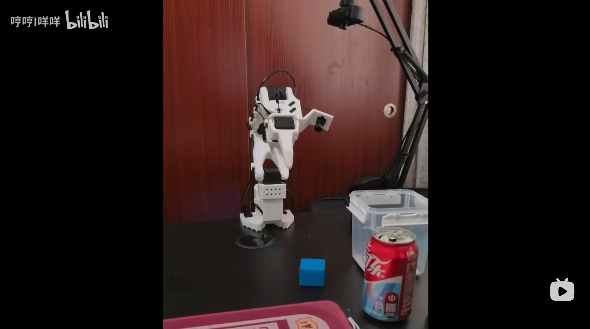

# Pi0 Peft (π0: A Vision-Language-Action Flow Model for General Robot Control)

> 论文链接: https://arxiv.org/pdf/2410.24164v1

<div align="center">


</div>

## 01 数据采集
将主从机械臂以及 front 和 hand_eye 相机通过 USB 连接到本地主机，确定端口号之后执行下述脚本
```
bash tools/pi0/01_collect_data.sh
```
脚本中的 `--robot.id` 以及 `--teleop.id` 需要和校准机械臂时的 id 保持一致，否则会寻找不到校准文件。<br>

采集每一条 episode 时需要动作流畅不要有过长时间的静止，失败的 episode 需要删除掉。

## 02 删除 leading idle frames
每个 episode 前的闲置静止的帧是有害的，需要删掉, 运行下述脚本删除
```
bash tools/pi0/02_idle_trim.sh
```

## 03 分布式训练
训练前我们需要下载文本的 Tokenizer 以及 pi0 的预训练权重，国内按照下述方式下载较快：
```
pip install modelscope


# 下载 Tokenizer
modelscope download --model google/paligemma-3b-pt-224

# pi0 预训练权重
modelscope download --model lerobot/pi0_base
```
在下载好的预训练权重的配置文件中将 Tokenizer 的路径修改为下载的 google/paligemma-3b-pt-224。 然后在 `03_dist_train.sh` 脚本中配置好预训练权重路径，在远程服务器上执行下述脚本进行分布式训练:
```
bash tools/pi0/03_dist_train.sh
```

## 04 本地主机上 rollout
从服务器中下载 Peft 的权重，在脚本 `04_rollout.sh` 配置好预训练权重路径以及 Peft 权重路径, 在本地主机上执行下述脚本进行 rollout:
```
bash tools/pi0/04_rollout.sh
```
[](https://www.bilibili.com/video/BV12v876MEYH/?vd_source=d3c91656eb1a8e7284849bfdb83a2d61)
