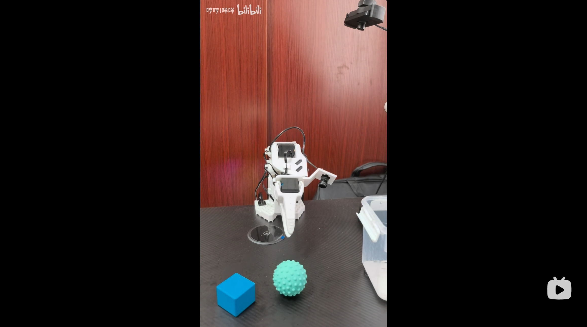

# Pi0 Peft (π0: A Vision-Language-Action Flow Model for General Robot Control)

> 论文链接: https://arxiv.org/pdf/2506.01844

<div align="center">


</div>

## 01 数据采集
将主从机械臂以及 front 和 hand_eye 相机通过 USB 连接到本地主机，确定端口号之后执行下述脚本
```
bash tools/pi0/01_collect_data.sh
```
脚本中的 `--robot.id` 以及 `--teleop.id` 需要和校准机械臂时的 id 保持一致，否则会寻找不到校准文件。<br>

采集每一条 episode 时需要动作流畅不要有过长时间的静止，失败的 episode 需要删除掉。

## 02 删除 leading idle frames
每个 episode 前的闲置静止的帧是有害的，需要删掉, 运行下述脚本删除
```
bash tools/pi0/02_idle_trim.sh
```

## 03 分布式训练

```
bash tools/smolvla/01_dist_train.sh
```

## 04 本地主机上 rollout
从服务器中下载训练好的权重，在脚本 `02_rollout.sh` 配置好权重路径, 在本地主机上执行下述脚本进行 rollout:
```
bash tools/smolvla/02_rollout.sh
```

[](https://www.bilibili.com/video/BV1ek8r6SEH6/?spm_id_from=333.1387.upload.video_card.click&vd_source=d3c91656eb1a8e7284849bfdb83a2d61)

